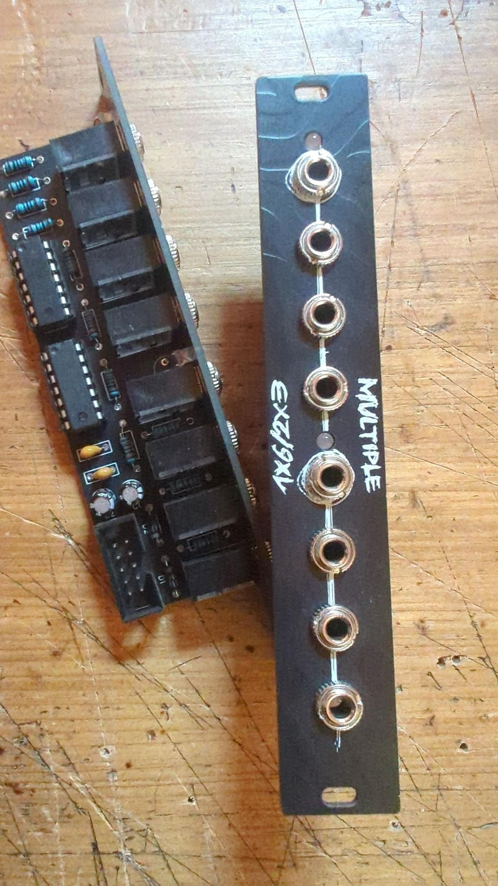

# buffered multiple
a buffered multiple with LED-indication in 4HP.
It's useable for audio and CV signals.
The LEDs will light up if there is a signal on the corresponding Input. (The signal has to be strong enough to light up the LED, so it is not a perfect indication of the signal being present, but it is good enough for most cases.)
Because we use a bi-color LED, the color will change depending on the polarity of the signal (Or both colors for audio signals).
As long you have not connected something to the second Input, the first Input will be copied to all 6 Outputs. If you connect something to the second Input, the first Input will be copied to the first 3 Outputs and the second Input will be copied to the last 3 Outputs.

## Build
- Order the PCBs from the PCB manufacturer of your choice.
- Order the components from your favorite electronics supplier. (Make sure to use 2pin bi-color LEDs)
- Solder the components to the PCB and mount the panel.

